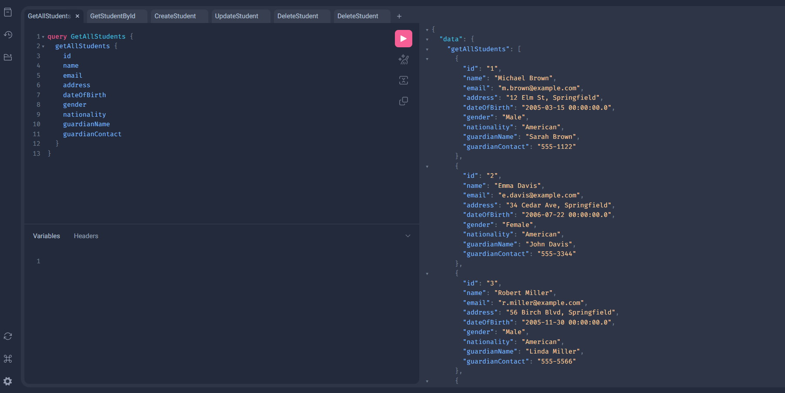

# Springboot GraphQL API with MySQL

This project is a Spring Boot microservice that implements GraphQL for managing student data. It integrates with a MySQL database and is containerized using Docker.

## Setup Instructions

1. **Clone the repository:**
   ```
   git clone https://github.com/RobertoDure/springboot-graphql-api.git
   cd springboot-graphql-api
   ```

2. **Configure MySQL Database:**
   Update the `src/main/resources/application.properties` file with your MySQL database connection details.

    ```properties
   spring.datasource.url=jdbc:mysql://localhost:3306/spring_graphql_db
   spring.datasource.username=root
   spring.datasource.password=root
   spring.jpa.hibernate.ddl-auto=update
   spring.jpa.show-sql=true
   spring.jpa.properties.hibernate.dialect=org.hibernate.dialect.MySQL8Dialect
   ```
3. GraphQL Config 
   Update the `src/main/resources/application.properties` file with your GraphQL configuration.

    ```properties
   spring.graphql.graphiql.enabled=true
   ```
   
4. GraphQL Schema
   The GraphQL schema is defined in `src/main/resources/graphql/schema.graphqls`. You can modify this file to change the schema as needed.


5. **Build the project:**
   Use Maven to build the project:
   ```
   mvn clean install
   ```

6. **Run with Docker:**
   To run the application and MySQL database using Docker, execute:
   ```
   docker-compose up -d
   ```

7. **Access the GraphQL endpoint:**
   The GraphQL endpoint and GraphQL Playground will be available at `http://localhost:8080/graphiql?path=/graphql`.


   

```
   query GetAllStudents {
       getAllStudents {
        id
        name
        email
        address
        dateOfBirth
        gender
        nationality
        guardianName
        guardianContact
    }
}
   ```

## Usage

- You can perform queries and mutations related to the `Student` entity using the GraphQL endpoint.
- The `Student` entity includes the following fields:
  - `name`: The name of the student.
  - `email`: The email address of the student.
  - `address`: The address of the student.

## Docker

The project includes a `Dockerfile` and `docker-compose.yml` for easy deployment and management of the application and its dependencies.

## License

This project is licensed under the MIT License.